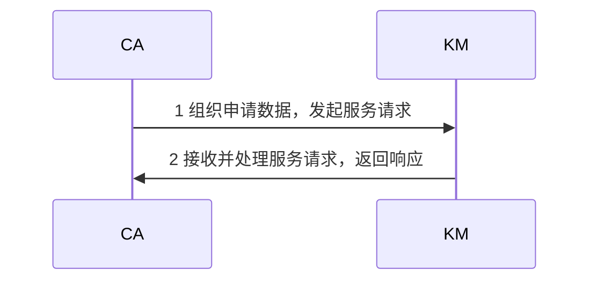

# 密钥管理服务设计

- [密钥管理服务设计](#%E5%AF%86%E9%92%A5%E7%AE%A1%E7%90%86%E6%9C%8D%E5%8A%A1%E8%AE%BE%E8%AE%A1)
  - [1 参考资料](#1-%E5%8F%82%E8%80%83%E8%B5%84%E6%96%99)
  - [2 术语](#2-%E6%9C%AF%E8%AF%AD)
  - [3 总体设计原则](#3-%E6%80%BB%E4%BD%93%E8%AE%BE%E8%AE%A1%E5%8E%9F%E5%88%99)
  - [4 要求](#4-%E8%A6%81%E6%B1%82)
    - [4.1 性能要求](#41-%E6%80%A7%E8%83%BD%E8%A6%81%E6%B1%82)
    - [4.2. 管理员配置要求](#42-%E7%AE%A1%E7%90%86%E5%91%98%E9%85%8D%E7%BD%AE%E8%A6%81%E6%B1%82)
    - [4.3 KMC 初始化要求](#43-kmc-%E5%88%9D%E5%A7%8B%E5%8C%96%E8%A6%81%E6%B1%82)
  - [5 各个模块功能](#5-%E5%90%84%E4%B8%AA%E6%A8%A1%E5%9D%97%E5%8A%9F%E8%83%BD)
    - [5.1 密钥生成模块](#51-%E5%AF%86%E9%92%A5%E7%94%9F%E6%88%90%E6%A8%A1%E5%9D%97)
    - [5.2 密钥管理模块](#52-%E5%AF%86%E9%92%A5%E7%AE%A1%E7%90%86%E6%A8%A1%E5%9D%97)
    - [5.3 密钥库管理模块](#53-%E5%AF%86%E9%92%A5%E5%BA%93%E7%AE%A1%E7%90%86%E6%A8%A1%E5%9D%97)
    - [5.4 认证管理模块](#54-%E8%AE%A4%E8%AF%81%E7%AE%A1%E7%90%86%E6%A8%A1%E5%9D%97)
    - [5.5 密钥恢复模块](#55-%E5%AF%86%E9%92%A5%E6%81%A2%E5%A4%8D%E6%A8%A1%E5%9D%97)
    - [5.6 密码服务模块](#56-%E5%AF%86%E7%A0%81%E6%9C%8D%E5%8A%A1%E6%A8%A1%E5%9D%97)
  - [6 通信流程](#6-%E9%80%9A%E4%BF%A1%E6%B5%81%E7%A8%8B)
  - [7 接口](#7-%E6%8E%A5%E5%8F%A3)

## 1 参考资料

- GMT 0034-2014 基于SM2密码算法的证书认证系统密码及其相关安全技术规范
- GMT 0014-2012 数字证书认证系统密码协议规范
- GMT 0019-2012 通用密码服务接口规范
- GMT 0020-2012 证书应用综合服务接口规范

## 2 术语

| 术语 | 定义 | 缩写 | 详细信息 |
| --- | --- | --- | --- |
| 密钥管理中心 | key management center | KMC | - |
| 密钥管理系统 | key management | KM | - |
| 证书认证机构 | certificate authority | CA | 对数字证书进行全生命周期管理的实体，也称为电子认证服务机构或认证中心 |
| 证书注册机构 | registration authority | RA | 受理数字证书的申请、更新、恢复和注销等业务的实体 |

## 3 总体设计原则

- 密码运算必须在密码设备完成

## 4 要求

### 4.1 性能要求

- 系统支持多并发服务请求
- 各模块的状态信息保存在配置文件和数据库内部，保证系统的部署方便性和配置方便性
- 各模块的功能可通过配置文件进行控制，系统可根据不同的需求进行设置

### 4.2. 管理员配置要求

在 KMC 应设置下列管理和操作人员

| 管理员类型 | 描述 | 权限 |
| --- | --- | --- |
| 超级管理员 | 负责 KMC 系统的策略设置，设置各子系统的业务管理员并对其管理的业务范围进行授权 | 增删改 KM 业务管理员账号 |
| 业务管理员 | 负责 KMC 系统的某个子系统的业务管理，设置本子系统的业务操作员并对其的操作权限进行授权 | 增删改 KM 业务操作员账号 |
| 业务操作员 | 按其权限进行具体的业务操作 | 生成/存储/备份/恢复密钥 |
| 审计管理员 | 负责删除审计员并进行管理 | 增删改 KM 审计员账号 |
| 审计员 | 负责对涉及系统安全的事件和各类管理和操作人员的行为进行审计和监督 | 创建、查询审计记录或日志 |
| 安全管理员 | - | 全面负责系统的安全工作 |

- 暂时只需要一个超级管理员完成所有功能
- 暂时只支持使用用户名和密码登录

### 4.3 KMC 初始化要求

KMC 的初始化过程必须完成下列工作：

- 生成 KMC 的机构密钥
- 由根 CA 签发 KMC 机构证书

## 5 各个模块功能

### 5.1 密钥生成模块

- 非对称密钥的生成
- 对称密钥的生成
- 随机数的生成

### 5.2 密钥管理模块

- 接收、审核 CA 的密钥申请
- 调用备用密钥库中的密钥对
- 向 CA 发送密钥对
- 对调用的备用密钥库中的密钥对进行处理，并将其转移到在用密钥库
- 对在用密钥库中的密钥进行定期检查，将超过有效期或被撤销的密钥转移到历史密钥库
- 对历史密钥库中的密钥进行处理，将超过规定保留期的密钥转移到规定载体
- 对进入本系统的有关操作及操作人员进行身份与权限的认证

### 5.3 密钥库管理模块

- 密钥的存储管理，按照存储的密钥的状态分为备用库、在用库和历史库
  - 备用库：存放待使用的密钥对。密钥生成模块预生成一批密钥对，存放在备用库；CA 需要时，可及时调出，转入在用库
    - 备用密钥库应保持一定数量的待用密钥对，存放的密钥数量依据系统的用户数量而定，若少于设定的最低数量应自动补充到规定数量
  - 在用库：存放当前使用的密钥对。在用库的密钥记录包含用户证书的序列号、ID 号、有效时间和作废时间等标志
  - 历史库：存放过期或已被注销的密钥对。历史库的密钥记录包含用户证书的序列号、ID 号、有效时间和作废时间等标志
- 密钥库中的密钥数据必须加密处理

### 5.4 认证管理模块

- 认证管理模块负责对进入本系统的有关操作及操作人员进行身份与权限的认证

### 5.5 密钥恢复模块

- 密钥恢复模块负责为用户和司法取证恢复用户的加密私钥，被恢复的私钥必须安全地下载到载体
- 用户密钥恢复流程：
  - 用户通过 RA 申请
  - 经审核后，由 CA 向密钥管理中心提出密钥恢复请求
  - 密钥恢复模块恢复用户的密钥并通过 CA 返回 RA，下载于用户证书载体

### 5.6 密码服务模块

- 密码服务模块负责为密钥管理系统的各项业务提供密码支持
- 密码服务模块配置经国家密码管理主管部门审批的非对称密钥密码算法、对称密钥密码算法和数据摘要算法等
- 密码算法必须在硬件密码设备中运行

## 6 通信流程

- KM 系统接收 CA 系统的密钥服务请求，将处理结果返回给 CA
- 请求：CA 提出，发送到 KM。CA 在生成用户加密证书、更新加密证书、撤销加密证书时，先组织密钥服务请求，发送到 KM，并延缓自身的事务处理过程，等待 KM 响应
- 响应：KM 发起，发送到 CA。KM 在接收到 CA 的请求后，检查确定请求的合法性，处理服务请求，将结果返回给 CA

- 上述流程的协议内容包括：
  - 请求：密钥服务请求，包括 CA 请求的类型、特质以及特性数据。服务请求包括以下数据：
    - 协议版本(当前版本为 2)
    - 服务请求标识符
    - CA 标识符
    - 扩展的请求信息
    - 请求信息的签名
  - 响应：是 KM 对 CA 请求的处理响应。响应包括以下数据：
    - 协议版本(当前版本为 2)
    - 响应标识符
    - KM 标识符
    - 响应信息
    - 响应信息的签名
  - 异常情况：当 CA 和 KM 任何一方处理发生错误时，均需向对方发送错误信息。错误类型有：
    - 验证请求失败：KM 验证 来自 CA 证书或 CA 请求数据失败，CA 收到后重新进行申请
    - 内部处理失败：KM 处理 CA 请求过程中发生内部错误，通知 CA 该处理请求失败，需 CA 重新申请
- 本保证采用抽象语法表示法(ASN.10)描述具体协议内容。默认使用 ASN.1 显示标记

## 7 接口

密码服务的接口遵循 `GMT 0019-2012 通用密码服务接口规范` 和 `GMT 0020-2012 证书应用综合服务接口规范`