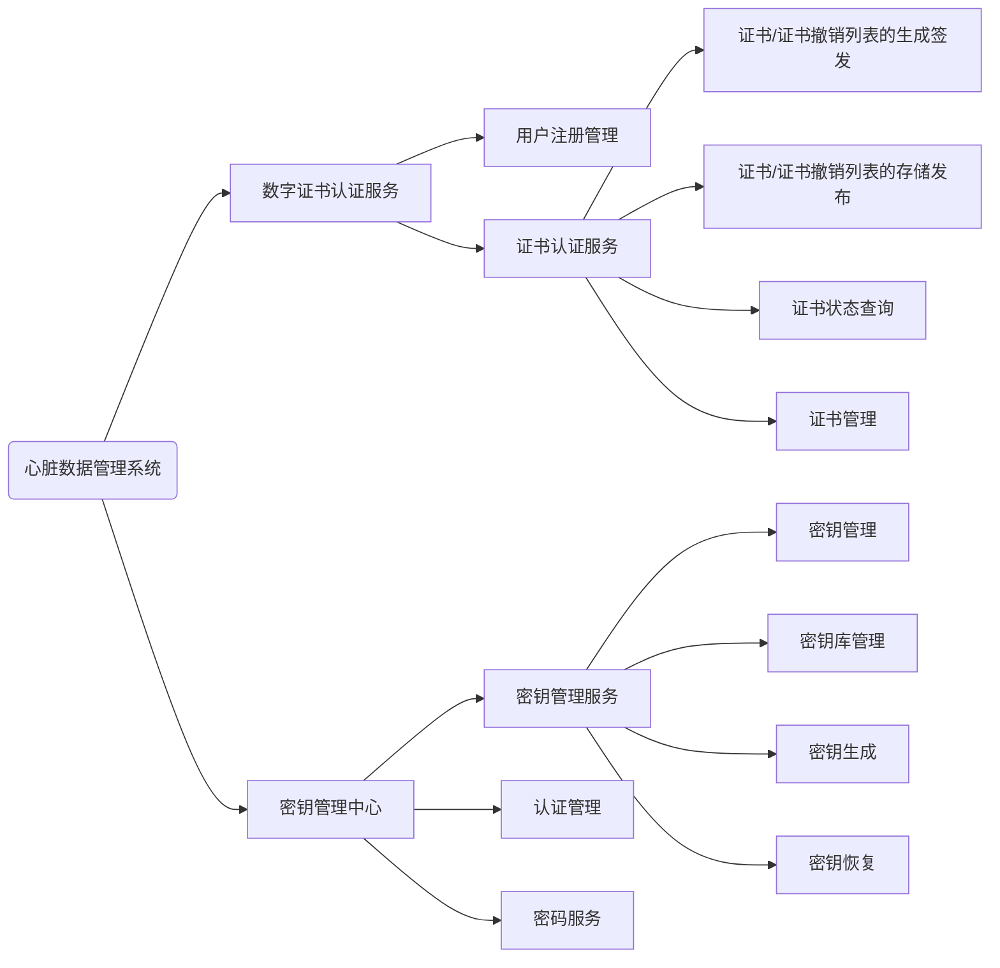
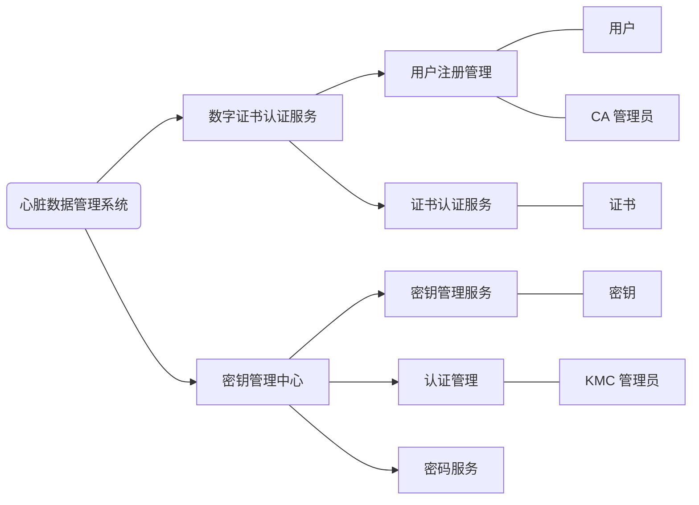

# 安全密钥管理系统

- [安全密钥管理系统](#%E5%AE%89%E5%85%A8%E5%AF%86%E9%92%A5%E7%AE%A1%E7%90%86%E7%B3%BB%E7%BB%9F)
  - [1 参考资料](#1-%E5%8F%82%E8%80%83%E8%B5%84%E6%96%99)
  - [2 术语](#2-%E6%9C%AF%E8%AF%AD)
  - [3 需求分析](#3-%E9%9C%80%E6%B1%82%E5%88%86%E6%9E%90)
    - [3.1 基本需求](#31-%E5%9F%BA%E6%9C%AC%E9%9C%80%E6%B1%82)
    - [3.2 分析结构图](#32-%E5%88%86%E6%9E%90%E7%BB%93%E6%9E%84%E5%9B%BE)
  - [4 概念结构设计](#4-%E6%A6%82%E5%BF%B5%E7%BB%93%E6%9E%84%E8%AE%BE%E8%AE%A1)
  - [5 逻辑结构设计](#5-%E9%80%BB%E8%BE%91%E7%BB%93%E6%9E%84%E8%AE%BE%E8%AE%A1)
  - [6 物理结构设计](#6-%E7%89%A9%E7%90%86%E7%BB%93%E6%9E%84%E8%AE%BE%E8%AE%A1)
    - [6.1 管理员表(administrator)](#61-%E7%AE%A1%E7%90%86%E5%91%98%E8%A1%A8administrator)
    - [6.2 主体(subject)](#62-%E4%B8%BB%E4%BD%93subject)
    - [6.3 用户表(user)](#63-%E7%94%A8%E6%88%B7%E8%A1%A8user)
    - [6.4 密钥表(key)](#64-%E5%AF%86%E9%92%A5%E8%A1%A8key)
    - [6.5 证书表(certificate)](#65-%E8%AF%81%E4%B9%A6%E8%A1%A8certificate)
  - [7.数据库总表](#7%E6%95%B0%E6%8D%AE%E5%BA%93%E6%80%BB%E8%A1%A8)

## 1 参考资料

- GMT 0034-2014 基于SM2密码算法的证书认证系统密码及其相关安全技术规范
- [概要设计](./../概要设计.md)
- [数字证书服务设计](./../数字证书服务设计.md)
- [密钥管理中心服务设计](./../密钥管理中心服务设计.md)
- [密码机服务设计](./../密码机服务设计.md)

## 2 术语

| 术语 | 定义 | 缩写 | 详细信息 |
| --- | --- | --- | --- |
| SKMS | Secure Key Management System, 安全密钥管理系统 |
| 密钥管理中心 | key management center | KMC | - |
| 密钥管理系统 | key management | KM | - |
| 证书认证机构 | certificate authority | CA | 对数字证书进行全生命周期管理的实体, 也称为电子认证服务机构或认证中心 |
| 证书注册机构 | registration authority | RA | 受理数字证书的申请、更新、恢复和注销等业务的实体 |
| DCC | Digital Certificate Certificate Service, 数字证书认证服务 |
| URM | User Registration Management, 用户注册管理 |
| CAS | Certificate Authority Service, 证书认证服务 |
| GAS | Generation And Sign, 证书/证书撤销列表的生成签发 |
| SAR | Storage And Release, 证书/证书撤销列表的存储发布 |
| CSQ | Certificate Status Query, 证书状态查询 |
| CEM | Certificate Management, 证书管理 |
| KMS | Key Management Service, 密钥管理服务 |
| AUM | Authority Management, 认证管理 |
| CIS | Cipher Service, 密码服务 |
| KEM | Key Management, 密钥管理 |
| KDM | Key Database Management, 密钥库管理 |
| KEG | Key Generation, 密钥生成 |
| KER | Key Restoration, 密钥恢复 |

## 3 需求分析

### 3.1 基本需求

- CA 管理员
  - CA 超级管理员: 增删改 CA 业务管理员账号
  - CA 业务管理员: 增删改 CA 业务操作员账号
  - CA 业务操作员: 管理证书模板、配置证书策略、对系统进行配置, 如配置主机加密服务器参数、目录服务器、CA 系统参数、RA 系统参数等；增删改 RA 业务管理员和 RA 审计员账号
  - CA 审计管理员: 增删改 CA 审计员账号
  - CA 审计员: 查询 CA 系统日志、查询审计 CA 操作记录
  - RA 业务管理员: 增删改 RA 业务操作员账号
  - RA 业务操作员: 对证书申请的录入；对证书更新申请、密钥恢复申请的录入；审核证书申请、撤销审核；证书的下载、制作；证书查询；审核证书更新请求和密钥恢复请求；录入和审核工作不能由同一人兼任
  - RA 审计员: 查询 RA 系统日志、查询审计 RA 操作记录
  - 安全管理员: 全面负责系统的安全工作
- KMC 管理员
  - 超级管理员: 增删改 KM 业务管理员账号
  - 业务管理员: 增删改 KM 业务操作员账号
  - 业务操作员: 生成/存储/备份/恢复密钥
  - 审计管理员: 增删改 KM 审计员账号
  - 审计员: 创建、查询审计记录或日志
  - 安全管理员: 全面负责系统的安全工作
- 用户
  - 用户信息:
- 密钥管理
  - 密钥信息: 用户证书的序列号、ID 号、有效时间、作废时间、密钥标记
    - 密钥标记: 备用、在用、历史
- 证书管理
  - 证书标记: 有效、已吊销

### 3.2 分析结构图

## 4 概念结构设计

## 5 逻辑结构设计

- 格式说明: **主键**, ***外键***
- 实体表
  - 管理员(**管理员 id**、账户、密码、管理员类型、父节点 id)
  - 主体信息(**主体 id**、国家、省份、地市、组织名称、机构名称)
  - 用户(**用户 id**、用户加密证书序列号、公钥、用户姓名、主体 id)
  - 密钥(**密钥 id**、用户加密证书的序列号、ID 号、有效时间、作废时间、密钥标记)
  - 证书(**证书 id**、用户加密证书序列号、用户加密公钥、用户加密私钥数据信封、证书标记)

## 6 物理结构设计

- 数据库名: bmi_skms
  - skms: Secure Key Management System
  - 数据库类型: mongodb
  - 关系类型: NoSql
  - 存储类型:
    - datetime: 时间格式 yyyy-mm-dd hh:mm:ss
- 说明:
  - pri: 主键
  - uni: 唯一值
  - mul: 允许重复, 值不唯一, 外键

### 6.1 管理员表(administrator)

- 字段信息

| 域 | 类型 | 是否为 NULL | 键 | 默认 | 注释 |
| --- | --- | --- | --- | --- | --- |
| id | ObjectId | N | pri | (NULL) | 编号 |
| name  | string | Y | uni | (NULL)  | 用户名 |
| password | string | Y | - | (NULL)  | 密码 |
| type | number | N | - | (NULL)  | 管理员类型 |
| parent_id | ObjectId | Y | - | (NULL)  | 父节点编号 |

- 管理员类型说明

| 值 | 含义 |
| --- | --- |
| 1 | CA 超级管理员 |
| 2 | CA 业务管理员 |
| 3 | CA 业务操作员 |
| 4 | CA 审计管理员 |
| 5 | CA 审计员 |
| 6 | CA 安全管理员 |
| 7 | RA 业务管理员 |
| 8 | RA 业务操作员 |
| 9 | RA 审计员 |
| 10 | KMC 超级管理员 |
| 11 | KMC 业务管理员 |
| 12 | KMC 业务操作员 |
| 13 | KMC 审计管理员 |
| 14 | KMC 审计员 |
| 15 | KMC 安全管理员 |

- 索引信息

| 索引 | 列 | 索引类型 |
| --- | --- | --- |
| primary | id | unique |
| primary | name | unique |

### 6.2 主体(subject)

- 字段信息

| 域 | 类型 | 是否为 NULL | 键 | 默认 | 注释 |
| --- | --- | --- | --- | --- | --- |
| id | ObjectId | N | pri | (NULL) | 编号 |
| country  | string | Y | - | (NULL)  | 国家 |
| state  | string | Y | - | (NULL)  | 省份 |
| locality  | string | Y | - | (NULL)  | 地市 |
| organ  | string | Y | - | (NULL)  | 组织名称 |
| organ_unit  | string | Y | - | (NULL)  | 机构名称 |

- 索引信息

| 索引 | 列 | 索引类型 |
| --- | --- | --- |
| primary | id | unique |

### 6.3 用户表(user)

- 字段信息

| 域 | 类型 | 是否为 NULL | 键 | 默认 | 注释 |
| --- | --- | --- | --- | --- | --- |
| id | ObjectId | N | pri | (NULL) | 编号 |
| cert_no  | string | N | uni | (NULL)  | 用户加密证书序列号 |
| pub_key  | string | N | - | (NULL)  | 用户签名公钥 |
| name  | string | Y | - | (NULL)  | 用户姓名 |
| subject_id  | ObjectId | Y | - | (NULL)  | 主体 id |

- 索引信息

| 索引 | 列 | 索引类型 |
| --- | --- | --- |
| primary | id | unique |
| primary | cert_no | unique |

### 6.4 密钥表(key)

- 字段信息

| 域 | 类型 | 是否为 NULL | 键 | 默认 | 注释 |
| --- | --- | --- | --- | --- | --- |
| id | ObjectId | N | pri | (NULL) | 编号 |
| cert_no  | string | Y | uni | (NULL)  | 用户加密证书序列号 |
| id_no  | string | Y | - | (NULL)  | ID 号 |
| start_time  | datetime | Y | - | (NULL)  | 有效时间 |
| end_time  | datetime | Y | - | (NULL)  | 作废时间 |
| flag | number | N | - | 1  | 密钥标记 |

- 密钥标记说明

| 值 | 含义 |
| --- | --- |
| 1 | 备用 |
| 2 | 在用 |
| 3 | 历史 |

- 索引信息

| 索引 | 列 | 索引类型 |
| --- | --- | --- |
| primary | id | unique |
| primary | cert_no | unique |

### 6.5 证书表(certificate)

- 字段信息

| 域 | 类型 | 是否为 NULL | 键 | 默认 | 注释 |
| --- | --- | --- | --- | --- | --- |
| id | ObjectId | N | pri | (NULL) | 编号 |
| cert_no  | string | N | uni | (NULL)  | 用户加密证书序列号 |
| cipher_pub  | string | Y | - | (NULL)  | 用户加密公钥 |
| cipher_pri  | datetime | Y | - | (NULL)  | 用户加密私钥数据信封 |
| flag | number | N | - | 1  | 证书标记 |

- 证书标记说明

| 值 | 含义 |
| --- | --- |
| 1 | 有效 |
| 2 | 已吊销 |

- 索引信息

| 索引 | 列 | 索引类型 |
| --- | --- | --- |
| primary | id | unique |
| primary | cert_no | unique |

## 7.数据库总表

