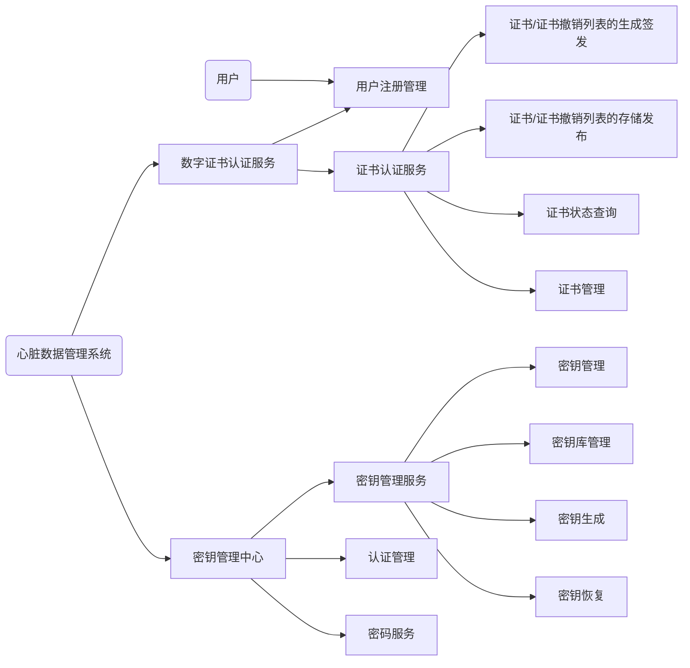
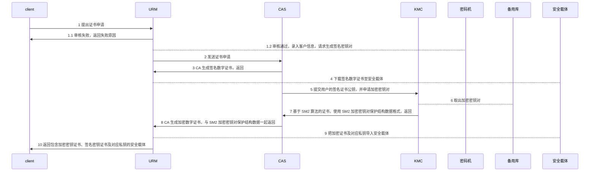
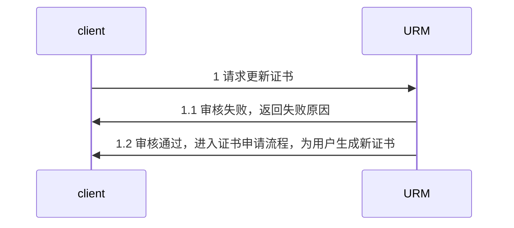
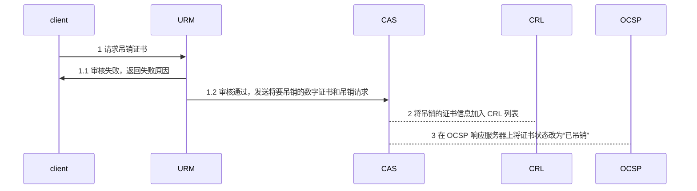
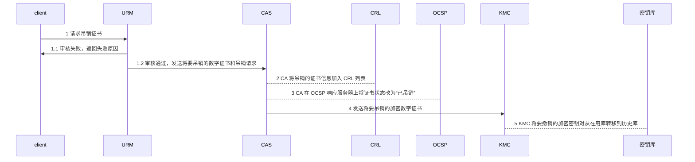
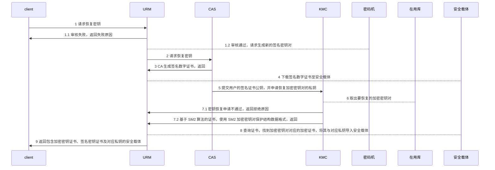
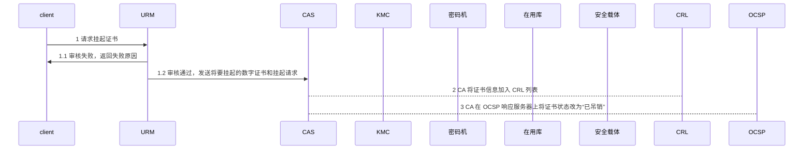
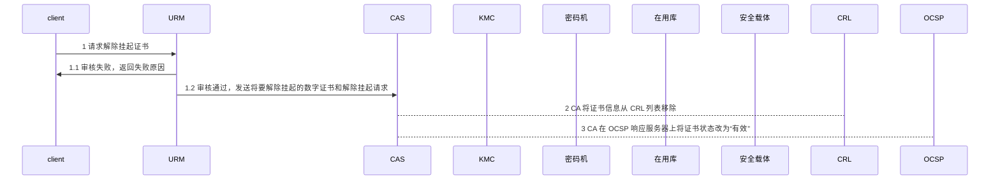

# 安全密钥管理系统概要设计文档

- [安全密钥管理系统概要设计文档](#%E5%AE%89%E5%85%A8%E5%AF%86%E9%92%A5%E7%AE%A1%E7%90%86%E7%B3%BB%E7%BB%9F%E6%A6%82%E8%A6%81%E8%AE%BE%E8%AE%A1%E6%96%87%E6%A1%A3)
  - [1 引言](#1-%E5%BC%95%E8%A8%80)
    - [1.1 编写目的](#11-%E7%BC%96%E5%86%99%E7%9B%AE%E7%9A%84)
    - [1.2 背景](#12-%E8%83%8C%E6%99%AF)
    - [1.3 定义](#13-%E5%AE%9A%E4%B9%89)
    - [1.4 参考资料](#14-%E5%8F%82%E8%80%83%E8%B5%84%E6%96%99)
  - [2 总体设计](#2-%E6%80%BB%E4%BD%93%E8%AE%BE%E8%AE%A1)
    - [2.1 需求规定](#21-%E9%9C%80%E6%B1%82%E8%A7%84%E5%AE%9A)
    - [2.2 运行环境](#22-%E8%BF%90%E8%A1%8C%E7%8E%AF%E5%A2%83)
    - [2.3 基本设计概念和处理流程](#23-%E5%9F%BA%E6%9C%AC%E8%AE%BE%E8%AE%A1%E6%A6%82%E5%BF%B5%E5%92%8C%E5%A4%84%E7%90%86%E6%B5%81%E7%A8%8B)
    - [2.4 结构](#24-%E7%BB%93%E6%9E%84)
    - [2.5 功能需求与程序的关系](#25-%E5%8A%9F%E8%83%BD%E9%9C%80%E6%B1%82%E4%B8%8E%E7%A8%8B%E5%BA%8F%E7%9A%84%E5%85%B3%E7%B3%BB)
    - [2.6 人工处理过程](#26-%E4%BA%BA%E5%B7%A5%E5%A4%84%E7%90%86%E8%BF%87%E7%A8%8B)
    - [2.7 尚未解决的问题](#27-%E5%B0%9A%E6%9C%AA%E8%A7%A3%E5%86%B3%E7%9A%84%E9%97%AE%E9%A2%98)
  - [3 接口设计](#3-%E6%8E%A5%E5%8F%A3%E8%AE%BE%E8%AE%A1)
    - [3.1 用户接口](#31-%E7%94%A8%E6%88%B7%E6%8E%A5%E5%8F%A3)
    - [3.2 外部接口](#32-%E5%A4%96%E9%83%A8%E6%8E%A5%E5%8F%A3)
    - [3.3 内部接口](#33-%E5%86%85%E9%83%A8%E6%8E%A5%E5%8F%A3)
  - [4 运行设计](#4-%E8%BF%90%E8%A1%8C%E8%AE%BE%E8%AE%A1)
    - [4.1 运行模块组合](#41-%E8%BF%90%E8%A1%8C%E6%A8%A1%E5%9D%97%E7%BB%84%E5%90%88)
      - [4.1.1 证书申请](#411-%E8%AF%81%E4%B9%A6%E7%94%B3%E8%AF%B7)
      - [4.1.2 证书更新](#412-%E8%AF%81%E4%B9%A6%E6%9B%B4%E6%96%B0)
      - [4.1.3 证书吊销](#413-%E8%AF%81%E4%B9%A6%E5%90%8A%E9%94%80)
        - [4.1.3.1 签名证书吊销](#4131-%E7%AD%BE%E5%90%8D%E8%AF%81%E4%B9%A6%E5%90%8A%E9%94%80)
        - [4.1.3.2 加密证书吊销](#4132-%E5%8A%A0%E5%AF%86%E8%AF%81%E4%B9%A6%E5%90%8A%E9%94%80)
      - [4.1.4 用户密钥恢复](#414-%E7%94%A8%E6%88%B7%E5%AF%86%E9%92%A5%E6%81%A2%E5%A4%8D)
      - [4.1.5 证书挂起](#415-%E8%AF%81%E4%B9%A6%E6%8C%82%E8%B5%B7)
      - [4.1.6 解除证书挂起](#416-%E8%A7%A3%E9%99%A4%E8%AF%81%E4%B9%A6%E6%8C%82%E8%B5%B7)
    - [4.2 运行控制](#42-%E8%BF%90%E8%A1%8C%E6%8E%A7%E5%88%B6)
    - [4.3 运行时间](#43-%E8%BF%90%E8%A1%8C%E6%97%B6%E9%97%B4)
  - [5 系统数据结构设计](#5-%E7%B3%BB%E7%BB%9F%E6%95%B0%E6%8D%AE%E7%BB%93%E6%9E%84%E8%AE%BE%E8%AE%A1)
    - [5.1 逻辑结构设计要点](#51-%E9%80%BB%E8%BE%91%E7%BB%93%E6%9E%84%E8%AE%BE%E8%AE%A1%E8%A6%81%E7%82%B9)
    - [5.2 物理结构设计要点](#52-%E7%89%A9%E7%90%86%E7%BB%93%E6%9E%84%E8%AE%BE%E8%AE%A1%E8%A6%81%E7%82%B9)
    - [5.3 数据结构与程序的关系](#53-%E6%95%B0%E6%8D%AE%E7%BB%93%E6%9E%84%E4%B8%8E%E7%A8%8B%E5%BA%8F%E7%9A%84%E5%85%B3%E7%B3%BB)
  - [6 系统出错处理设计](#6-%E7%B3%BB%E7%BB%9F%E5%87%BA%E9%94%99%E5%A4%84%E7%90%86%E8%AE%BE%E8%AE%A1)
    - [6.1 出错信息](#61-%E5%87%BA%E9%94%99%E4%BF%A1%E6%81%AF)
    - [6.2 补救措施](#62-%E8%A1%A5%E6%95%91%E6%8E%AA%E6%96%BD)
    - [6.3 系统维护设计](#63-%E7%B3%BB%E7%BB%9F%E7%BB%B4%E6%8A%A4%E8%AE%BE%E8%AE%A1)

## 1 引言

### 1.1 编写目的

该文档主要用于说明安全密钥管理系统的概要设计。预期读者为此项目的开发者。

### 1.2 背景

本软件系统被命名为 SKMS(Secure Key Management System，安全密钥管理系统)，包括 web 前端和后端服务。

### 1.3 定义

| 定义 | 描述 |
| --- | --- |
| SKMS | Secure Key Management System，安全密钥管理系统 |
| KMC | Key Management Center，密钥管理中心 |
| KM | Key Management，密钥管理系统 |
| CA | Certificate Authority，证书认证机构 |
| RA | Registration Authority，证书注册机构 |
| CRL | Certificate Revocation List，证书撤销列表 |
| DCC | Digital Certificate Certificate Service, 数字证书认证服务 |
| URM | User Registration Management, 用户注册管理 |
| CAS | Certificate Authority Service, 证书认证服务 |
| GAS | Generation And Sign, 证书/证书撤销列表的生成签发 |
| SAR | Storage And Release, 证书/证书撤销列表的存储发布 |
| CSQ | Certificate Status Query, 证书状态查询 |
| CEM | Certificate Management, 证书管理 |
| KMS | Key Management Service, 密钥管理服务 |
| AUM | Authority Management, 认证管理 |
| CIS | Cipher Service, 密码服务 |
| KEM | Key Management, 密钥管理 |
| KDM | Key Database Management, 密钥库管理 |
| KEG | Key Generation, 密钥生成 |
| KER | Key Restoration, 密钥恢复 |

### 1.4 参考资料

- GMT 0034-2014 基于SM2密码算法的证书认证系统密码及其相关安全技术规范

## 2 总体设计

### 2.1 需求规定

系统功能包括证书认证系统功能和密钥管理中心系统功能

- 证书认证系统的主要功能包括：用户注册管理、证书/证书撤销列表的生成与签发、证书撤销列表的存储与发布、证书状态的查询和安全管理
- 密钥管理中心系统的主要功能包括：密钥生成、密钥存储、密钥分发、密钥备份、密钥更新、密钥撤销、密钥归档、密钥恢复
- 用户注册管理系统、证书/证书撤销列表生成与签发系统、密钥管理中心可设置独立的数据库

### 2.2 运行环境

- 用户设备平台支持 Windows 客户端，支持 Win7/Win8/Win10 系统，并兼容 Windows 家庭版、旗舰版、专业版
- 数据库采用 MySQL 和 Mycat。客户端和服务端使用 HTTP 通信，服务端内部使用 RabbitMQ 和 Redis 通信

### 2.3 基本设计概念和处理流程

### 2.4 结构

### 2.5 功能需求与程序的关系

### 2.6 人工处理过程

无

### 2.7 尚未解决的问题

无

## 3 接口设计

### 3.1 用户接口

本系统用户接口为用户与客户端的交互界面。用户通过客户端界面同系统进行交互。

### 3.2 外部接口

本系统暂无外部接口。

### 3.3 内部接口

内部接口分三类

- 客户端与服务端的接口
- 服务端服务之间的接口
- 服务端与数据库的接口

## 4 运行设计

### 4.1 运行模块组合

#### 4.1.1 证书申请

- 通常签名密钥对是在安全载体中生成，其内部已保存签名私钥对

#### 4.1.2 证书更新

#### 4.1.3 证书吊销

##### 4.1.3.1 签名证书吊销

##### 4.1.3.2 加密证书吊销

#### 4.1.4 用户密钥恢复

- 通常签名密钥对是在安全载体中生成，其内部已保存签名私钥对
  - 若签名私钥对不是在安全载体中生成的，需通过密钥对保护方式将加密的签名密钥对导入到安全载体
  - 密钥对保护方式参考 `GMT 0016-2012 智能密码钥匙密码应用接口规范`
- 客户原有的加密数字证书可继续使用，无需 CA 重新签发

#### 4.1.5 证书挂起

#### 4.1.6 解除证书挂起

### 4.2 运行控制

本系统暂无运行控制。

### 4.3 运行时间

- 客户端可由用户退出账号到主界面，或关闭窗口退出程序
- 服务端程序默认一直运行，崩溃后自动重启

## 5 系统数据结构设计

### 5.1 逻辑结构设计要点

参考[数据库设计](./数据库设计/数据库设计.md)

| 名称 | 表名 | 元素 |
| --- | --- | --- |
| 管理员 | administrator | 管理员编号、账户、密码、管理员类型、父节点 id |
| 主体信息 | subject | 主体编号、国家、省份、地市、组织名称、机构名称 |
| 用户 | user | 用户编号、用户加密证书序列号、公钥、用户姓名、主体 id |
| 密钥 | key | 密钥编号、用户加密证书的序列号、ID 号、有效时间、作废时间、密钥标记 |
| 证书 | certificate | 证书编号、用户加密证书序列号、用户加密公钥、用户加密私钥数据信封、证书标记 |

### 5.2 物理结构设计要点

- 系统内的数据具体存储的物理结构由数据库管理
- 对于性能要求高的服务可以分布式部署到物理机上，提高任务并发数

### 5.3 数据结构与程序的关系

| 数据表 | URM | CAS | KMS | AUM | CIS |
| --- | --- | --- | --- | --- | --- |
| administrator | y | - | - | y | - |
| subject | y | - | - | - | - |
| user | - | y | - | - | - |
| key | - | - | y | - | - |
| certificate | - | y | - | - | - |

## 6 系统出错处理设计

对于用户的非法输入，系统需要保持鲁棒性，提示错误信息，同时不影响系统的正常运行

### 6.1 出错信息

| 故障 | 输出信息形式 | 输出信息含义 | 处理方法 |
| --- | --- | --- | --- |
| | | | |

### 6.2 补救措施

无。

### 6.3 系统维护设计

- 客户端写日志文件，记录对服务端的访问操作，以及服务端异常返回信息
- 服务端记录客户端的访问操作，关键业务流程打印上下文信息。关键业务流程包括
  - 模块相互之间的功能调用
  - CRL 的更新
  - 证书的操作